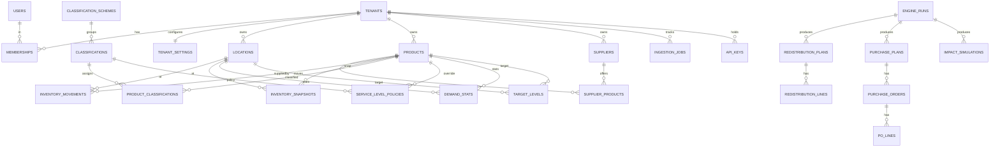

# Modelo de Datos — Optimizador de Inventario

DDL de referencia (PostgreSQL 16+). Acompaña a
[inventory-optimizer.md](inventory-optimizer.md). El DDL es la fuente de verdad
del esquema; las migraciones Prisma se generan a partir de este diseño.

Convenciones:
- Claves primarias `id uuid default gen_random_uuid()`.
- Toda tabla de negocio incluye `tenant_id uuid not null` y RLS (ver §RLS).
- Timestamps `created_at`, `updated_at timestamptz not null default now()`.
- Montos en `numeric(18,4)`; cantidades en `numeric(18,4)` (admite fraccional).
- Códigos de negocio (`code`, `sku`) son únicos **dentro del tenant**.

---

## 1. Diagrama entidad-relación



---

## 2. Identidad y configuración

```sql
create table tenants (
  id          uuid primary key default gen_random_uuid(),
  name        text not null,
  slug        text not null unique,
  status      text not null default 'active',   -- active | suspended
  created_at  timestamptz not null default now(),
  updated_at  timestamptz not null default now()
);

create table users (
  id            uuid primary key default gen_random_uuid(),
  email         text not null unique,
  name          text,
  password_hash text,                            -- null si SSO
  locale        text not null default 'es',      -- es | en
  theme         text not null default 'system',  -- system | light | dark
  created_at    timestamptz not null default now(),
  updated_at    timestamptz not null default now()
);

create table memberships (
  id         uuid primary key default gen_random_uuid(),
  tenant_id  uuid not null references tenants(id) on delete cascade,
  user_id    uuid not null references users(id) on delete cascade,
  role       text not null default 'member',     -- owner | admin | member | viewer
  created_at timestamptz not null default now(),
  unique (tenant_id, user_id)
);

create table tenant_settings (
  tenant_id            uuid primary key references tenants(id) on delete cascade,
  cost_of_capital_pct  numeric(6,4)  not null default 0.20,  -- anual
  default_service_level numeric(6,4) not null default 0.95,
  global_lead_time_days integer      not null default 7,
  review_period_days    integer      not null default 1,
  abc_a_pct            numeric(6,4)  not null default 0.80,
  abc_b_pct            numeric(6,4)  not null default 0.15,
  abc_basis            text          not null default 'margin', -- margin | revenue
  stockout_threshold   numeric(18,4) not null default 0,        -- qty_on_hand <= umbral
  default_locale       text          not null default 'es',
  default_theme        text          not null default 'system',
  updated_at           timestamptz   not null default now()
);
```

---

## 3. Maestros de negocio

```sql
create table locations (
  id         uuid primary key default gen_random_uuid(),
  tenant_id  uuid not null references tenants(id) on delete cascade,
  code       text not null,
  name       text not null,
  type       text not null,                       -- store | warehouse
  is_active  boolean not null default true,
  created_at timestamptz not null default now(),
  updated_at timestamptz not null default now(),
  unique (tenant_id, code)
);

create table suppliers (
  id                    uuid primary key default gen_random_uuid(),
  tenant_id             uuid not null references tenants(id) on delete cascade,
  code                  text not null,
  name                  text not null,
  min_order_value       numeric(18,4) not null default 0,
  default_lead_time_days integer      not null default 7,
  created_at            timestamptz not null default now(),
  updated_at            timestamptz not null default now(),
  unique (tenant_id, code)
);

create table products (
  id                  uuid primary key default gen_random_uuid(),
  tenant_id           uuid not null references tenants(id) on delete cascade,
  sku                 text not null,
  name                text not null,
  unit_cost           numeric(18,4) not null default 0,
  unit_price          numeric(18,4) not null default 0,
  pack_size           numeric(18,4) not null default 1,
  primary_supplier_id uuid references suppliers(id) on delete set null,
  is_active           boolean not null default true,
  created_at          timestamptz not null default now(),
  updated_at          timestamptz not null default now(),
  unique (tenant_id, sku)
);

create table supplier_products (
  id             uuid primary key default gen_random_uuid(),
  tenant_id      uuid not null references tenants(id) on delete cascade,
  supplier_id    uuid not null references suppliers(id) on delete cascade,
  product_id     uuid not null references products(id) on delete cascade,
  lead_time_days integer,                         -- null -> fallback supplier/global
  moq            numeric(18,4) not null default 0,
  order_multiple numeric(18,4) not null default 1,
  unit_cost      numeric(18,4),
  created_at     timestamptz not null default now(),
  updated_at     timestamptz not null default now(),
  unique (tenant_id, supplier_id, product_id)
);
```

**Resolución de lead time** (en el motor): `supplier_products.lead_time_days` ->
`suppliers.default_lead_time_days` -> `tenant_settings.global_lead_time_days`.

---

## 4. Datos transaccionales

```sql
create table inventory_movements (
  id           uuid primary key default gen_random_uuid(),
  tenant_id    uuid not null references tenants(id) on delete cascade,
  occurred_on  date not null,
  location_id  uuid not null references locations(id) on delete cascade,
  product_id   uuid not null references products(id) on delete cascade,
  type         text not null,                     -- sale|receipt|transfer_in|transfer_out|adjustment
  qty          numeric(18,4) not null,
  unit_price   numeric(18,4),                     -- relevante en sale
  unit_cost    numeric(18,4),
  source       text not null default 'csv',       -- csv | api
  external_id  text,                              -- idempotencia origen
  created_at   timestamptz not null default now(),
  unique (tenant_id, external_id)
);
create index on inventory_movements (tenant_id, product_id, location_id, occurred_on);
create index on inventory_movements (tenant_id, type, occurred_on);

create table inventory_snapshots (
  id          uuid primary key default gen_random_uuid(),
  tenant_id   uuid not null references tenants(id) on delete cascade,
  snapshot_on date not null,
  location_id uuid not null references locations(id) on delete cascade,
  product_id  uuid not null references products(id) on delete cascade,
  qty_on_hand numeric(18,4) not null default 0,
  qty_on_order numeric(18,4) not null default 0,
  created_at  timestamptz not null default now(),
  unique (tenant_id, snapshot_on, location_id, product_id)
);
create index on inventory_snapshots (tenant_id, product_id, location_id, snapshot_on);
```

> Si el cliente no provee snapshots, el motor los deriva acumulando
> `inventory_movements` (recepciones y traslados suman, ventas restan).

---

## 5. Clasificación y políticas de nivel de servicio

```sql
create table classification_schemes (
  id         uuid primary key default gen_random_uuid(),
  tenant_id  uuid not null references tenants(id) on delete cascade,
  code       text not null,                       -- ABC | PERISHABLE | SEASON ...
  name       text not null,
  kind       text not null default 'custom',      -- abc | custom
  created_at timestamptz not null default now(),
  unique (tenant_id, code)
);

create table classifications (
  id         uuid primary key default gen_random_uuid(),
  tenant_id  uuid not null references tenants(id) on delete cascade,
  scheme_id  uuid not null references classification_schemes(id) on delete cascade,
  code       text not null,                       -- A | B | C | "perecedero" ...
  name       text not null,
  created_at timestamptz not null default now(),
  unique (tenant_id, scheme_id, code)
);

create table product_classifications (
  id               uuid primary key default gen_random_uuid(),
  tenant_id        uuid not null references tenants(id) on delete cascade,
  product_id       uuid not null references products(id) on delete cascade,
  classification_id uuid not null references classifications(id) on delete cascade,
  assigned_by      text not null default 'system', -- system | user
  created_at       timestamptz not null default now(),
  unique (tenant_id, product_id, classification_id)
);

-- Política de nivel de servicio: por clase (classification_id) u override por SKU.
-- Exactamente uno de classification_id / product_id no nulo.
create table service_level_policies (
  id               uuid primary key default gen_random_uuid(),
  tenant_id        uuid not null references tenants(id) on delete cascade,
  classification_id uuid references classifications(id) on delete cascade,
  product_id       uuid references products(id) on delete cascade,
  service_level    numeric(6,4) not null,         -- 0..1
  created_at       timestamptz not null default now(),
  updated_at       timestamptz not null default now(),
  check ( (classification_id is not null) <> (product_id is not null) )
);
create unique index on service_level_policies (tenant_id, classification_id)
  where classification_id is not null;
create unique index on service_level_policies (tenant_id, product_id)
  where product_id is not null;
```

**Resolución de nivel de servicio** (precedencia): override por SKU
(`service_level_policies.product_id`) -> política de clase -> 
`tenant_settings.default_service_level`.

---

## 6. Resultados del motor

```sql
create table engine_runs (
  id          uuid primary key default gen_random_uuid(),
  tenant_id   uuid not null references tenants(id) on delete cascade,
  run_date    date not null,
  trigger     text not null default 'batch',      -- batch | on_demand
  status      text not null default 'running',     -- running | success | failed
  period_start date,
  period_end   date,
  metrics     jsonb,
  error       text,
  started_at  timestamptz not null default now(),
  finished_at timestamptz,
  unique (tenant_id, run_date, trigger)
);

create table demand_stats (
  id          uuid primary key default gen_random_uuid(),
  tenant_id   uuid not null references tenants(id) on delete cascade,
  run_id      uuid not null references engine_runs(id) on delete cascade,
  product_id  uuid not null references products(id) on delete cascade,
  location_id uuid not null references locations(id) on delete cascade,
  mean_daily  numeric(18,6) not null,
  std_daily   numeric(18,6) not null,
  adi         numeric(18,6),
  cv2         numeric(18,6),
  pattern     text,                                -- smooth|erratic|intermittent|lumpy
  data_points integer not null default 0,
  confidence  text not null default 'low',         -- low | medium | high
  fallback_to_class boolean not null default false,
  unique (run_id, product_id, location_id)
);

create table target_levels (
  id                uuid primary key default gen_random_uuid(),
  tenant_id         uuid not null references tenants(id) on delete cascade,
  run_id            uuid not null references engine_runs(id) on delete cascade,
  product_id        uuid not null references products(id) on delete cascade,
  location_id       uuid not null references locations(id) on delete cascade,
  service_level_used numeric(6,4) not null,
  lead_time_days    numeric(10,2) not null,
  safety_stock      numeric(18,4) not null,
  reorder_point     numeric(18,4) not null,
  order_up_to       numeric(18,4) not null,
  holding_cost      numeric(18,4) not null,
  unique (run_id, product_id, location_id)
);

create table lost_sales_estimates (
  id           uuid primary key default gen_random_uuid(),
  tenant_id    uuid not null references tenants(id) on delete cascade,
  run_id       uuid not null references engine_runs(id) on delete cascade,
  product_id   uuid not null references products(id) on delete cascade,
  location_id  uuid not null references locations(id) on delete cascade,
  stockout_days integer not null default 0,
  lost_units   numeric(18,4) not null default 0,
  lost_revenue numeric(18,4) not null default 0,
  lost_margin  numeric(18,4) not null default 0,
  unique (run_id, product_id, location_id)
);
```

### Redistribución

```sql
create table redistribution_plans (
  id         uuid primary key default gen_random_uuid(),
  tenant_id  uuid not null references tenants(id) on delete cascade,
  run_id     uuid not null references engine_runs(id) on delete cascade,
  status     text not null default 'draft',        -- draft | approved | discarded
  created_at timestamptz not null default now()
);

create table redistribution_lines (
  id                  uuid primary key default gen_random_uuid(),
  tenant_id           uuid not null references tenants(id) on delete cascade,
  plan_id             uuid not null references redistribution_plans(id) on delete cascade,
  product_id          uuid not null references products(id) on delete cascade,
  from_location_id    uuid not null references locations(id),
  to_location_id      uuid not null references locations(id),
  qty                 numeric(18,4) not null,
  expected_margin_recovered numeric(18,4) not null default 0,
  expected_revenue_recovered numeric(18,4) not null default 0,
  status              text not null default 'draft'
);
```

### Compras

```sql
create table purchase_plans (
  id         uuid primary key default gen_random_uuid(),
  tenant_id  uuid not null references tenants(id) on delete cascade,
  run_id     uuid not null references engine_runs(id) on delete cascade,
  status     text not null default 'draft',
  created_at timestamptz not null default now()
);

create table purchase_orders (
  id              uuid primary key default gen_random_uuid(),
  tenant_id       uuid not null references tenants(id) on delete cascade,
  plan_id         uuid not null references purchase_plans(id) on delete cascade,
  supplier_id     uuid not null references suppliers(id),
  total_value     numeric(18,4) not null default 0,
  meets_min_order boolean not null default true,
  status          text not null default 'draft',   -- draft | approved | sent (fase 2)
  created_at      timestamptz not null default now()
);

create table po_lines (
  id          uuid primary key default gen_random_uuid(),
  tenant_id   uuid not null references tenants(id) on delete cascade,
  po_id       uuid not null references purchase_orders(id) on delete cascade,
  product_id  uuid not null references products(id) on delete cascade,
  location_id uuid references locations(id),        -- destino sugerido (opcional)
  net_requirement numeric(18,4) not null,
  order_qty   numeric(18,4) not null,               -- tras MOQ/multiplo
  unit_cost   numeric(18,4) not null,
  line_value  numeric(18,4) not null,
  is_fill     boolean not null default false        -- relleno por min_order_value
);
```

### Impacto

```sql
create table impact_simulations (
  id                  uuid primary key default gen_random_uuid(),
  tenant_id           uuid not null references tenants(id) on delete cascade,
  run_id              uuid not null references engine_runs(id) on delete cascade,
  recovered_revenue   numeric(18,4) not null default 0,
  recovered_margin    numeric(18,4) not null default 0,
  released_capital    numeric(18,4) not null default 0,
  breakdown           jsonb,                          -- por clase/location/proveedor
  created_at          timestamptz not null default now()
);
```

---

## 7. Ingesta y API keys

```sql
create table ingestion_jobs (
  id           uuid primary key default gen_random_uuid(),
  tenant_id    uuid not null references tenants(id) on delete cascade,
  entity       text not null,                        -- sales|inventory|products|suppliers|supplier_products
  source       text not null,                        -- csv | api
  status       text not null default 'pending',      -- pending|validating|processing|completed|failed
  total_rows   integer not null default 0,
  valid_rows   integer not null default 0,
  error_rows   integer not null default 0,
  errors       jsonb,                                 -- [{row, field, message}]
  idempotency_key text,
  created_at   timestamptz not null default now(),
  finished_at  timestamptz,
  unique (tenant_id, idempotency_key)
);

create table api_keys (
  id          uuid primary key default gen_random_uuid(),
  tenant_id   uuid not null references tenants(id) on delete cascade,
  name        text not null,
  key_prefix  text not null,                          -- visible
  key_hash    text not null,                          -- hash del secreto
  scopes      text[] not null default '{ingest:write,read}',
  last_used_at timestamptz,
  revoked_at  timestamptz,
  created_at  timestamptz not null default now(),
  unique (tenant_id, key_prefix)
);
```

---

## 8. Row-Level Security (RLS) {#rls}

Patrón aplicado a **todas** las tablas con `tenant_id`. La aplicación establece la
variable de sesión `app.current_tenant` por conexión/transacción.

```sql
-- Ejemplo para products; replicar en cada tabla con tenant_id.
alter table products enable row level security;
alter table products force row level security;

create policy tenant_isolation on products
  using (tenant_id = current_setting('app.current_tenant')::uuid)
  with check (tenant_id = current_setting('app.current_tenant')::uuid);
```

Establecer el tenant por sesión:

```sql
-- Next.js (Prisma) y worker (SQLAlchemy) al abrir transacción:
select set_config('app.current_tenant', $1, true);  -- true = local a la transacción
```

Notas:
- Usar un rol de aplicación **sin** `BYPASSRLS`. Migraciones corren con rol
  privilegiado aparte.
- `tenants`, `users` (globales) no llevan RLS por tenant; el acceso se controla vía
  `memberships`.

---

## 9. Índices clave (resumen)

- `inventory_movements (tenant_id, product_id, location_id, occurred_on)` — base
  del cálculo de demanda.
- `inventory_snapshots (tenant_id, snapshot_on, location_id, product_id)` unique —
  snapshot diario.
- Resultados del motor con `unique (run_id, product_id, location_id)` para
  idempotencia por corrida.
