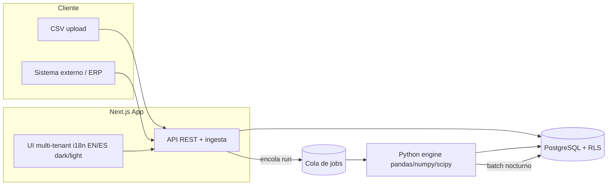
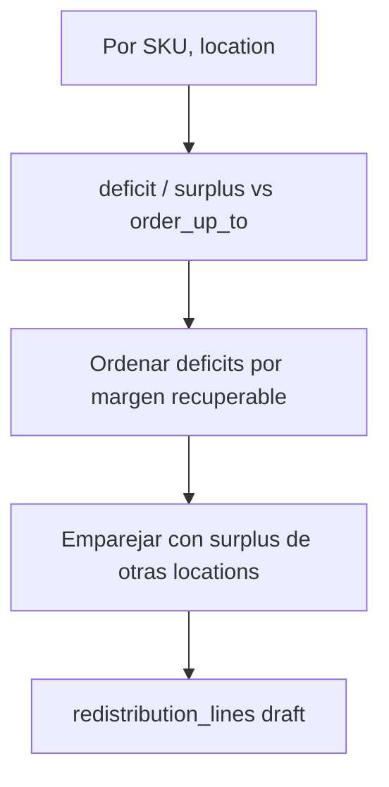
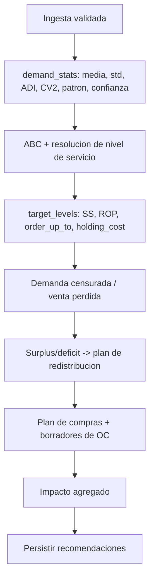

# Spec Técnico — Optimizador de Inventario (SaaS) · v1

Documento de especificación técnica de v1. Deriva de la intención confirmada en
[docs/intent/inventory-optimizer.md](../intent/inventory-optimizer.md).

Documentos complementarios:
- [data-model.md](data-model.md) — modelo de datos completo (DDL + RLS).
- [ingestion-contracts.md](ingestion-contracts.md) — contratos CSV y API REST.
- [scaffolding.md](scaffolding.md) — estructura del monorepo y stack.

> Las decisiones marcadas como **[DEFAULT]** las tomó el equipo de diseño por
> conveniencia técnica y pueden cambiarse sin alterar el alcance del producto.

---

## 1. Resumen del producto

SaaS multi-tenant que, dado un período, detecta venta perdida por faltante de stock
y sobreinventario por SKU-ubicación; recomienda un plan diario de redistribución
entre almacenes y un plan de compras con borradores de orden de compra por
proveedor, ambos priorizados por impacto monetario; y cuantifica el impacto
potencial (venta a recuperar + capital a liberar) como business case.

Alcance v1 (resumen; ver intención para el detalle):
- Niveles de inventario por nivel de servicio (modelo normal + detección de SKUs
  intermitentes marcados para fase 2).
- Redistribución (recomendación, no ejecución en ERP).
- Plan de compras + borradores de OC por proveedor (aprobación humana).
- Estimación de impacto (simulación / business case).
- Clasificación ABC automática + clasificaciones personalizables.
- Ingesta por CSV y API.
- Multi-tenant, i18n EN/ES, tema claro/oscuro.

Fuera de alcance v1: ejecución de transferencias en ERP, colocación automática de
OC al proveedor, integración bidireccional, modelos Poisson/Croston completos,
seguimiento de ROI realizado, pronóstico con ML.

---

## 2. Arquitectura



| Componente | Tecnología | Responsabilidad |
|---|---|---|
| Frontend + API | Next.js (App Router), TypeScript | UI, autenticación, ingesta, consulta de recomendaciones, disparo de corridas |
| ORM | **[DEFAULT]** Prisma | Acceso tipado a Postgres desde Next.js |
| Base de datos | PostgreSQL 16+ | Persistencia multi-tenant con RLS |
| Motor de cálculo | Python 3.12, FastAPI, pandas/numpy/scipy, SQLAlchemy | Estadística de demanda, niveles objetivo, demanda censurada, redistribución, compras, impacto |
| i18n | **[DEFAULT]** next-intl | Inglés / español |
| Theming | Tailwind CSS, clase `dark` | Tema claro/oscuro por usuario/tenant |
| Orquestación batch | **[DEFAULT]** cron + tabla de jobs | Corrida nocturna por tenant |

**Por qué dos servicios.** La estadística (Z por nivel de servicio, ABC,
ADI/CV², demanda censurada) vive de forma natural en el ecosistema Python
(numpy/scipy). Next.js queda como capa web/API. Ambos comparten Postgres; el
worker lee/escribe directamente y expone un endpoint on-demand para simulaciones.

**Multi-tenancy.** Una sola base de datos. Cada tabla de negocio lleva
`tenant_id`. Se aplica **Row-Level Security (RLS)** en Postgres con una variable
de sesión `app.current_tenant`; tanto Next.js (vía Prisma) como el worker
establecen esa variable por conexión/transacción. Detalle en
[data-model.md](data-model.md#rls).

---

## 3. Dominio y conceptos

- **Tenant**: empresa cliente. Aislamiento total de datos.
- **Location (ubicación)**: `store` (sucursal, donde ocurren ventas) o `warehouse`
  (almacén/CD, donde hay inventario). El inventario puede existir en ambos.
- **Product (SKU)**: artículo con costo, precio, proveedor principal y empaque.
- **Supplier (proveedor)**: con lead time, MOQ, múltiplo de orden y monto mínimo.
- **Movement (movimiento)**: evento de inventario (venta, recepción, traslado,
  ajuste). Fuente de verdad para reconstruir demanda y stock.
- **Snapshot**: foto diaria de `qty_on_hand` por SKU-ubicación (provista o derivada).
- **Service level (nivel de servicio)**: probabilidad objetivo de no quebrar stock
  durante el ciclo. Se asigna por clase, con override por SKU.
- **Clasificación**: ABC automática (por contribución) + esquemas personalizados.

---

## 4. Motor estadístico

Todas las cantidades se calculan por par **(SKU, location)** salvo que se indique
lo contrario. Granularidad base **diaria**; se agrega a semanal cuando reduce ruido.

### 4.1 Estadística de demanda

A partir de movimientos `sale` por día:

- `d̄` = demanda media diaria.
- `σ_d` = desviación estándar de la demanda diaria.
- `ADI` (Average Demand Interval) = promedio de períodos entre demandas no-cero.
- `CV²` = (σ de los tamaños de demanda no-cero / media de esos tamaños)².
- `data_points` = número de períodos observados con datos.

Importante: la `σ_d` y `d̄` deben calcularse sobre **días sin quiebre de stock**
para no contaminar la demanda real con ceros causados por faltante (ver §4.4).

### 4.2 Clasificación del patrón de demanda (Syntetos-Boylan)

| Patrón | Condición | Modelo v1 |
|---|---|---|
| `smooth` | `ADI < 1.32` y `CV² < 0.49` | Normal |
| `erratic` | `ADI < 1.32` y `CV² ≥ 0.49` | Normal (marcado) |
| `intermittent` | `ADI ≥ 1.32` y `CV² < 0.49` | **Marcado para fase 2** (Croston/Poisson) |
| `lumpy` | `ADI ≥ 1.32` y `CV² ≥ 0.49` | **Marcado para fase 2** |

En v1 todos usan el modelo normal; `intermittent` y `lumpy` se calculan igual pero
se marcan (`pattern` + bandera) para que el usuario sepa que la precisión es
limitada y para habilitar modelos avanzados en fase 2 sin migración.

### 4.3 Nivel objetivo (modelo periódico order-up-to)

**[DEFAULT]** Se usa el modelo periódico *order-up-to* (`S`) en lugar de punto de
reorden continuo, porque encaja con la corrida diaria por lotes.

Sea:
- `LT` = lead time medio (días) del SKU con su proveedor principal (fallback global).
- `R` = período de revisión (días). Para compras `R` = cadencia de revisión de
  compra; para redistribución `R = 1` (diaria).
- `σ_LT` = desviación estándar del lead time (si se desconoce, `0`).
- `Z(SL)` = inversa de la normal estándar del nivel de servicio (cycle service
  level), `scipy.stats.norm.ppf(SL)`.

Fórmulas:

```
SS          = Z(SL) * sqrt( (LT + R) * σ_d²  +  d̄² * σ_LT² )
order_up_to = d̄ * (LT + R) + SS
ROP         = d̄ * LT + SS
```

- `SS` = stock de seguridad.
- `order_up_to (S)` = nivel objetivo al que se repone.
- `ROP` = punto de reorden (señal de cuándo comprar).

**Nota [DEFAULT]:** v1 usa *cycle service level* (probabilidad de no quiebre por
ciclo), no *fill rate*. Migrar a fill rate es una mejora de fase 2 que afecta solo
el cálculo de `Z`/`SS`, no el modelo de datos.

#### Ejemplo trabajado

SKU con `d̄ = 20`/día, `σ_d = 6`, `LT = 7` días, `σ_LT = 0`, `R = 1`, `SL = 0.95`
(`Z = 1.645`):

```
SS          = 1.645 * sqrt(8 * 36 + 0) = 1.645 * sqrt(288) = 1.645 * 16.97 ≈ 27.9 → 28
order_up_to = 20 * 8 + 28 = 188
ROP         = 20 * 7 + 28 = 168
```

### 4.4 Demanda censurada (venta perdida)

Cuando hay quiebre de stock, la venta observada es 0 aunque exista demanda. Se
**estima** la demanda latente:

1. Detectar intervalos de quiebre por (SKU, location): días con
   `qty_on_hand <= 0` (umbral configurable).
2. Estimar la **tasa esperada** `λ` con los días sin quiebre del mismo
   (SKU, location).
3. Ajustar por **índice de estacionalidad** `s_t` del período, derivado de las
   locations que sí tenían stock (o de la cadena completa del tenant) para ese SKU.
4. Calcular:

```
lost_units  = Σ_{días en quiebre} ( λ * s_t )  −  ventas_reales_en_esos_días
lost_revenue = lost_units * unit_price
lost_margin  = lost_units * (unit_price − unit_cost)
```

Se reporta **tanto ingreso como margen**; la métrica de impacto primaria es el
margen.

### 4.5 Costo del nivel de servicio

```
holding_cost = SS * unit_cost * cost_of_capital_pct
```

`cost_of_capital_pct` es un parámetro anual global por tenant. Permite mostrar el
costo marginal de subir el nivel de servicio de una clase (ej. pasar clase A de
95% a 98%).

### 4.6 Clasificación ABC

- Ranking de SKUs por contribución anualizada. **[DEFAULT]** por **margen**
  (configurable a ingreso).
- Contribución acumulada vs umbrales del tenant (`a_pct=0.80`, `b_pct=0.15`,
  resto = C) **[DEFAULT]**.
- Resultado: clase A/B/C que alimenta la política de nivel de servicio por clase.

### 4.7 Confianza por SKU

`confidence` es función de `data_points` y del span temporal disponible:

- `< 12` puntos de demanda → confianza **baja**: el SKU **cae a la estimación de
  su clase** (usa `d̄`/`σ_d` agregados de la clase) en vez de su estadística propia.
- 12–52 puntos → confianza **media**.
- `≥ 52` puntos (≈1 año) → confianza **alta**.

La UI muestra el nivel de confianza para no dar recomendaciones falsamente
precisas.

---

## 5. Motor de redistribución

Recomendación diaria de traslados entre ubicaciones del mismo tenant. **No** se
ejecuta en el ERP.

Algoritmo greedy por impacto:

1. Por (SKU, location) calcular:
   - `deficit = max(0, order_up_to − on_hand)` (receptor potencial).
   - `surplus = max(0, on_hand − order_up_to)` (donante potencial).
2. Para cada SKU con déficit, estimar `expected_margin_recovered` (venta que se
   deja de perder al cubrir el déficit, valuada en margen).
3. Ordenar déficits por `expected_margin_recovered` descendente.
4. Emparejar cada déficit con surplus disponible de otras ubicaciones
   (**[DEFAULT]** preferir donante con mayor surplus; la distancia/costo de
   traslado entra en fase 2).
5. Generar `redistribution_lines` (origen, destino, SKU, qty, margen esperado).



---

## 6. Motor de compras y órdenes de compra

1. Requerimiento neto por (SKU, location o consolidado):
   `net_requirement = order_up_to − (on_hand + on_order + inbound_transfers)`.
2. Asignar el SKU a su `primary_supplier`.
3. Agrupar requerimientos por proveedor.
4. Aplicar restricciones del proveedor:
   - Redondear hacia arriba al `order_multiple`.
   - Respetar `moq` (cantidad mínima por línea).
   - Validar `min_order_value` del proveedor; si el total no alcanza, **marcar** la
     OC y **[DEFAULT]** sugerir relleno con los SKUs de mayor prioridad (margen)
     hasta superar el mínimo.
5. Generar **borradores de OC por proveedor** (`status = draft`) con líneas.
   La aprobación es humana; el envío automático al proveedor es **fase 2**.

---

## 7. Estimación de impacto (business case)

Simulación what-if sobre el snapshot de inventario actual; agrega:

- **Venta a recuperar**: suma de `expected_margin_recovered` (y su equivalente en
  ingreso) de todos los déficits cubiertos por la redistribución y/o compras.
- **Capital a liberar**: `Σ (on_hand − order_up_to) * unit_cost` sobre las
  posiciones con surplus.

Se expone como endpoint on-demand al worker y se persiste en `impact_simulations`
para histórico y comparación. La UI lo presenta como tablero de business case
(totales por clase, por location, por proveedor).

---

## 8. Pipeline de cálculo (batch nocturno por tenant)



Cada paso es idempotente por `(tenant_id, run_date)`: re-correr una fecha
reemplaza sus resultados. Las corridas se registran en `engine_runs` con estado y
métricas.

---

## 9. UI (alto nivel)

Pantallas principales (todas multi-tenant, i18n, dark/light):

1. **Dashboard de impacto**: venta a recuperar y capital a liberar (margen e
   ingreso), filtros por período/location/clase.
2. **Redistribución**: lista de traslados recomendados, aprobar/exportar.
3. **Compras**: borradores de OC por proveedor, edición de cantidades, aprobar.
4. **Niveles de inventario**: target, SS, ROP, costo del nivel de servicio por SKU.
5. **Clasificación**: ABC + esquemas personalizados, políticas de nivel de servicio
   por clase y overrides por SKU.
6. **Ingesta**: carga de CSV, estado de jobs, errores por fila; gestión de API keys.
7. **Configuración**: costo de capital, nivel de servicio default, lead time
   global, locale, tema.

---

## 10. Decisiones [DEFAULT] sujetas a validación

| Decisión | Default elegido | Alternativa |
|---|---|---|
| Aislamiento multi-tenant | `tenant_id` + RLS, BD única | Schema/DB por tenant |
| ORM web | Prisma | Drizzle |
| i18n | next-intl | next-i18next |
| Modelo de inventario | Periódico order-up-to | Punto de reorden continuo |
| Métrica de nivel de servicio | Cycle service level | Fill rate |
| Base de clasificación ABC | Margen | Ingreso |
| Orquestación batch | cron + tabla de jobs | Cola dedicada (Celery/RQ) |
| Relleno de OC bajo `min_order_value` | Auto-sugerir por margen | Solo marcar |
