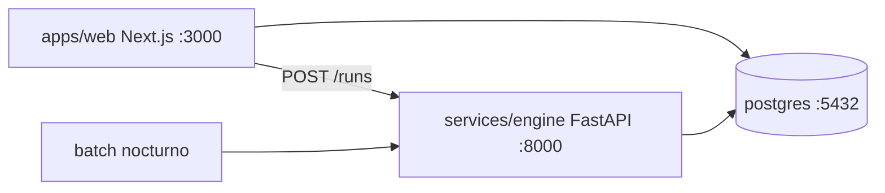

# Scaffolding del Proyecto — Optimizador de Inventario

Estructura de monorepo y stack para implementar el spec
([inventory-optimizer.md](inventory-optimizer.md)). Este documento define la
disposición de carpetas y servicios; la implementación del código es la siguiente
fase.

---

## 1. Estructura del monorepo

```
InventoryOptimizer/
  apps/
    web/                      # Next.js (App Router, TypeScript)
      app/                    # rutas, incl. [locale] para i18n
      components/             # UI (Tailwind, dark/light)
      lib/                    # prisma client, auth, tenant context (RLS)
      messages/               # en.json, es.json (next-intl)
      prisma/
        schema.prisma         # generado del modelo de datos
        migrations/
      package.json
  services/
    engine/                   # Motor Python (FastAPI + worker batch)
      app/
        api/                  # endpoints on-demand (runs, impact)
        core/                 # statistics, demand, censored, targets
        engines/              # redistribution, purchasing, impact
        db/                   # SQLAlchemy models, session con RLS
        jobs/                 # batch nocturno (entrypoint cron)
      tests/
      pyproject.toml
  db/
    ddl/                      # DDL de referencia (fuente del modelo)
    seeds/                    # datos demo por tenant
  docs/
    intent/
    spec/
  docker-compose.yml          # postgres + web + engine (dev)
  README.md
```

**[DEFAULT]** Monorepo simple por carpetas (sin herramienta de monorepo tipo
Turborepo/Nx en v1). Cada app gestiona sus propias dependencias.

---

## 2. Servicios (docker-compose, desarrollo)



| Servicio | Puerto | Imagen base | Notas |
|---|---|---|---|
| `postgres` | 5432 | `postgres:16` | volumen persistente; `gen_random_uuid` (pgcrypto) |
| `web` | 3000 | `node:22` | Next.js, Prisma |
| `engine` | 8000 | `python:3.12` | FastAPI + worker |

Variables de entorno (`.env`, no commit):
- `DATABASE_URL` (rol de app, **sin BYPASSRLS**).
- `DATABASE_MIGRATION_URL` (rol privilegiado, solo migraciones).
- `NEXTAUTH_SECRET` / auth.
- `ENGINE_URL` (web -> engine).
- `ENGINE_INTERNAL_TOKEN` (auth servicio-a-servicio).

---

## 3. Stack y dependencias principales

**apps/web (Next.js):**
- `next`, `react`, `typescript`
- `prisma`, `@prisma/client`
- `next-intl` (i18n EN/ES)
- `tailwindcss` (+ estrategia de tema con clase `dark`)
- librería de auth **[DEFAULT]** `next-auth`

**services/engine (Python 3.12):**
- `fastapi`, `uvicorn`
- `pandas`, `numpy`, `scipy`
- `sqlalchemy`, `psycopg[binary]`
- `pydantic` (validación de payloads)
- `pytest` (tests)

---

## 4. Contexto de tenant y RLS (integración)

Ambos servicios deben fijar `app.current_tenant` por transacción (ver
[data-model.md](data-model.md#rls)):

- **Web/Prisma:** middleware que resuelve el tenant desde la sesión/membership y
  ejecuta `SELECT set_config('app.current_tenant', $tenant, true)` al inicio de
  cada transacción (extensión de Prisma o `$executeRaw`).
- **Engine/SQLAlchemy:** un *event listener* de `begin` que aplica `set_config`
  con el tenant de la corrida.

El rol de aplicación **no** tiene `BYPASSRLS`. Las migraciones usan el rol
privilegiado de `DATABASE_MIGRATION_URL`.

---

## 5. Orden de implementación sugerido (fase siguiente)

1. `db/ddl` + migraciones Prisma del modelo de datos (con RLS).
2. `apps/web`: auth, contexto de tenant, layout i18n + dark/light, gestión de
   maestros (locations, products, suppliers) y API keys.
3. Ingesta CSV/API + `ingestion_jobs` (validación por fila).
4. `services/engine`: estadística de demanda -> niveles objetivo -> demanda
   censurada (con tests sobre el ejemplo trabajado del spec §4.3).
5. Motores de redistribución y compras.
6. Simulación de impacto + dashboards en la web.
7. Batch nocturno (`engine_runs`) + disparo on-demand.

---

## 6. Pruebas (mínimo por componente)

- **Engine:** tests unitarios de fórmulas (SS, ROP, order_up_to, Z(SL), ABC,
  ADI/CV², demanda censurada) validando el ejemplo trabajado del spec.
- **Web:** validación de contratos de ingesta (filas válidas/ inválidas) y
  aislamiento RLS entre dos tenants.
- **E2E [DEFAULT] (fase posterior):** carga CSV -> corrida -> impacto visible.
